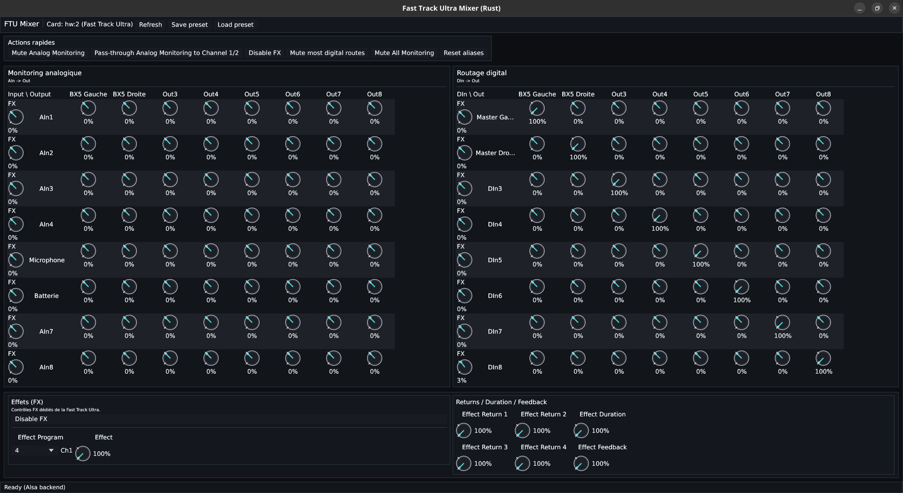

# Fast Track Ultra Rust Mixer

Desktop Linux app in Rust to control the M-Audio Fast Track Ultra with ALSA parity.

## Current State

- Audio backend: native ALSA.
- Renderer: `wgpu` by default, optional `glow`.
- Main UI: single "Monitoring & Routage" workspace with:
  - analog monitoring matrix (`AIn -> Out`)
  - digital routing matrix (`DIn -> Out`)
  - FX controls and quick actions
- Channel aliases (`AIn`, `DIn`, `Out`) saved in `~/.ftu-mixer/config.json`.
- Presets: save/load JSON and optional startup preset.

## Linux Prerequisites

- `libasound2-dev`
- `pkg-config`
- Rust toolchain (`cargo`, `rustc`)

## Run

```bash
cargo run --release -- --card 2
```

This uses `--render-mode wgpu` by default.

### Renderer Selection

```bash
# Explicit wgpu
cargo run --release -- --card 2 --render-mode wgpu
```

```bash
# OpenGL path
cargo run --release -- --card 2 --render-mode glow
```

### Startup Preset

```bash
cargo run --release -- --card 2 --load-preset ./my-preset.json
```

## Packaging Files

- Desktop entry: `ftu-rust-mixer.desktop`
- Man page: `docs/ftu-rust-mixer.1`
- App icon (PNG): `scripts/ftu-rust-mixer.png`
- Install script: `scripts/install-binary.sh`

## Notes

- On some systems/drivers, `glow` can be less stable than `wgpu`.

## Screenshot



