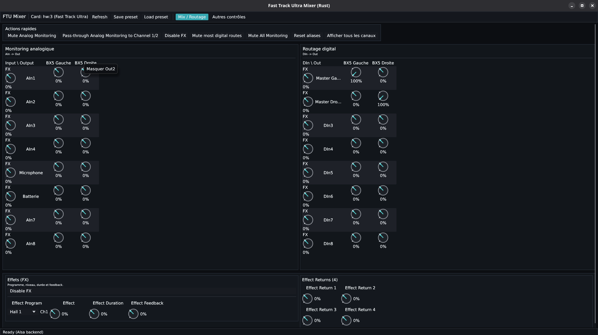

# Fast Track Ultra Rust Mixer


Desktop Linux app in Rust to control the M-Audio Fast Track Ultra with ALSA parity.

## Current State

- Audio backend: native ALSA.
- Renderer: `wgpu` by default, optional `glow`.
- Main UI: two workspaces:
  - **Mix / Routage**:
  - analog monitoring matrix (`AIn -> Out`)
  - digital routing matrix (`DIn -> Out`)
  - FX controls, effect returns, and quick actions
  - **Autres contrôles**: ALSA controls not part of routing matrices or FX section (clock, global gains, etc.).
- Channel aliases (`AIn`, `DIn`, `Out`) saved in `~/.ftu-mixer/config.json`.
- Channel visibility: hide/show any `AIn`, `DIn`, or `Out` directly from the UI (persisted in config).
- Presets: save/load JSON and optional startup preset.
  - Presets include *all* ALSA controls (including "Autres contrôles").

## Linux Prerequisites

- `libasound2-dev`
- `pkg-config`
- Rust toolchain (`cargo`, `rustc`)

## Run

```bash
cargo run --release -- --card 2
```

This uses `--render-mode wgpu` by default.

### Renderer Selection

```bash
# Explicit wgpu
cargo run --release -- --card 2 --render-mode wgpu
```

```bash
# OpenGL path
cargo run --release -- --card 2 --render-mode glow
```

### Startup Preset

```bash
cargo run --release -- --card 2 --load-preset ./my-preset.json
```

## Packaging Files

- Desktop entry: `ftu-rust-mixer.desktop`
- Man page: `docs/ftu-rust-mixer.1`
- App icon (PNG): `scripts/ftu-rust-mixer.png`
- Install script: `scripts/install-binary.sh`

## Notes

- On some systems/drivers, `glow` can be less stable than `wgpu`.
- The app reads ALSA enumerated item labels when available (e.g. "Effect Program" names).
- Small windows are supported via per-panel scrolling and automatic stacking of routing panels.

## UI Tips

- **Rename channels**: double-click an `AIn` / `DIn` / `Out` label.
- **Hide channels**: right-click an `AIn` / `DIn` / `Out` label.
- **Show everything**: use the "Afficher tous les canaux" quick action.

## Screenshot



